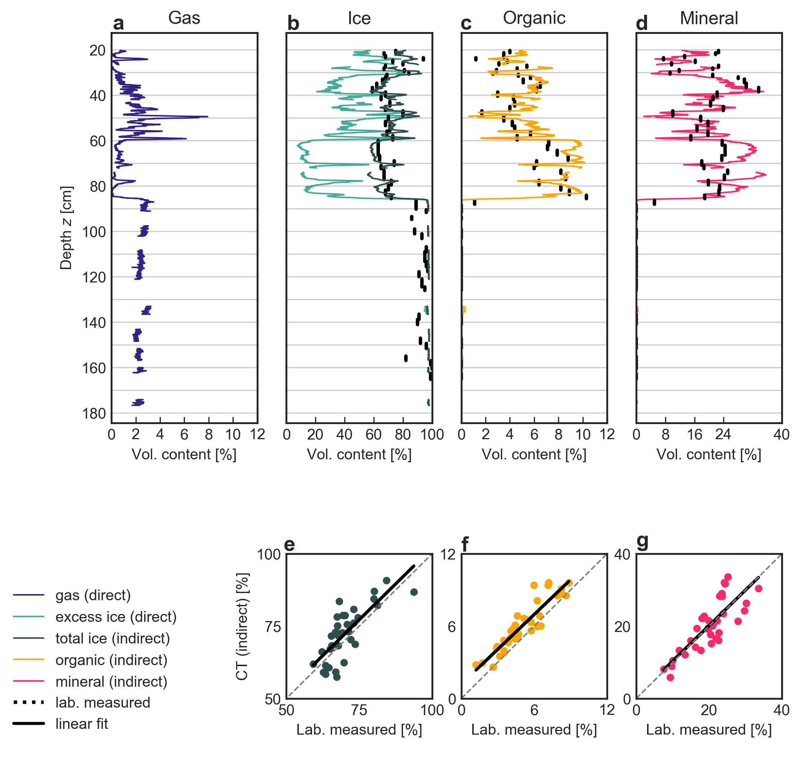

# Regression-analysis-of-the-X-ray-CT-derived-data-against-laboratory-measured-data

This code was initially created for my master's thesis: *Gadylyaev, D. (2021): Applying Computed Tomography (CT) scanning for segmentation of permafrost constituents in drill cores , Master thesis, University of Potsdam, Institute of Geosciences.* https://epic.awi.de/id/eprint/55281/

and after which it turned into a scientific paper (currently preprint): *Nitzbon, J., Gadylyaev, D., Schlüter, S., Köhne, J. M., Grosse, G., and Boike, J.: Brief communication: Unravelling the composition and microstructure of a permafrost core using X-ray computed tomography, The Cryosphere Discuss. [preprint], https://doi.org/10.5194/tc-2022-79, in review, 2022.*

### regression analysis_paper.py
This pyhton script uses the below listed input files to perform and evaluate a regression analysis of the CT data against the laboratory data. The regression result is the composition of the CT-derived sediment phases (A,B) in terms of pore ice, organic, and mineral. The script furthermore computes evaluation metrics of the lab-CT comparison, and computes volumetric contents of pore ice, total ice, organic, and mineral at the high resolution of the original CT data.

### volumetric_contents_sampleRes_lab+CT.csv
Contains the volumetric contents of total ice, organic, and mineral measured in the laboratory at AWI Potsdam at a coarse resolution. It further contains the volumetric contents of gas, excess ice, and two sediment phases (A,B) derived from a CT scan at UFZ Halle, downsampled to the resolution of the laboratory samples.

### volumetric_contents_highRes_CT.csv
Contains the volumetric contents of gas, excess ice, and two sediment phases (A,B) derived from a CT scan at UFZ Halle at the original resolution of 50µm.

### volumetric_contents_sampleRes_all.csv
This file can be reproduced by the files listed above and contains, in addition to the data contained in volumetric_contents_sampleRes_lab+CT.csv, the volumetric contents of pore ice, total ice, mineral, and organic as predicted by the regression model at the same (coarse) resolution as the laboratory samples.

### volumetric_contents_highRes_all.csv
This file can be reproduced by the files listed above and contains, in addition to the data contained in volumetric_contents_highRes_CT.csv, the volumetric contents of pore ice, total ice, mineral, and organic as predicted by the regression model at the same (high) resolution as the original CT data.

